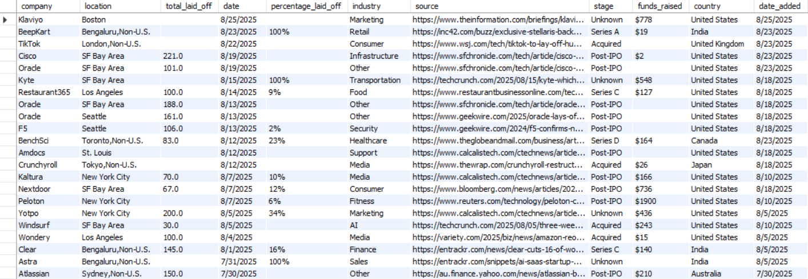
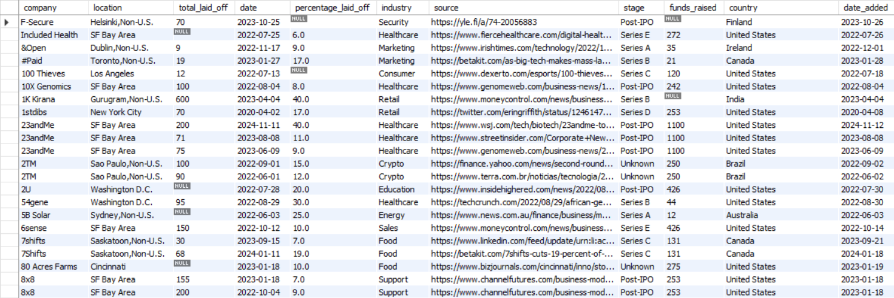

# 🧹 SQL Data Cleaning on Global Layoffs

[](https://www.mysql.com/)
[](https://github.com/SAHFEERULWASIHF/SQL-Data-Cleaning-on-Global-Layoffs-Dataset/stargazers)
[](https://github.com/SAHFEERULWASIHF/SQL-Data-Cleaning-on-Global-Layoffs-Dataset/network/members)
[](LICENSE)

This project focuses on cleaning a dataset of company layoffs to prepare it for further **Exploratory Data Analysis (EDA)**.  
The data cleaning was performed entirely in **SQL (MySQL)**.

---

## 📌 Project Overview

The raw `layoffs.csv` dataset contains inconsistencies such as:
- Duplicate rows
- Extra spaces in text fields
- Inconsistent industry and country naming
- Invalid or empty date formats
- Null values in certain columns

Through systematic SQL transformations, these issues were resolved and a **clean dataset** was produced:  
👉 `cleaned_data/clean_data_layoffs.csv`

---

## Dataset
- **Source:** Public dataset of global layoffs (CSV imported into SQL database).  
- **Columns include:**  
  - `company` – Name of the company  
  - `location` – City or region of the company  
  - `industry` – Industry sector  
  - `total_laid_off` – Number of employees laid off  
  - `percentage_laid_off` – Layoff percentage  
  - `date` – Date of layoff  
  - `date_added` – Date when record was added  
  - `stage` – Company funding stage  
  - `country` – Country of the company  
  - `funds_raised` – Funds raised by the company  
  - `source` - information source

---

## ⚙️ Steps in Data Cleaning

### 1. Back up the Original Data
- Created a backup table `layoffs_duplicate` to preserve the original dataset before manipulation.

### 2. Remove Duplicates
- Identified duplicates using `ROW_NUMBER()` in a **CTE** partitioned by all key columns.  
- Removed duplicates by keeping only the first occurrence.

### 3. Standardize Data
- Trimmed whitespace from `company` names.  
- Standardized country names (e.g., `united arab emirates` → `UAE`).  
- Converted date columns (`date`, `date_added`) to SQL `DATE` type.  
- Converted numeric columns:  
  - `total_laid_off` → `BIGINT`  
  - `percentage_laid_off` → `DECIMAL(5,1)`  
  - `funds_raised` → `BIGINT`  

### 4. Handle Null Values
- Converted empty strings to `NULL`.  
- Populated missing `country` values using corresponding `location`.  
- Checked and handled nulls in `industry` column.  
- Deleted rows where both `total_laid_off` and `percentage_laid_off` were null.

### 5. Drop Unnecessary Columns
- Dropped temporary columns such as `rn` used for deduplication.
  
### 6. **Final Output**
   - Exported the cleaned dataset into `cleaned_data/clean_data_layoffs.csv`.

---

## 📂 Repository Structure
```
SQL-Data-Cleaning-on-Global-Layoffs-Dataset/
│── README.md
│── Data_Cleaning_Project_using_layoffs_data.sql
│
├── data/
│   ├── layoffs.csv # Raw dataset
│   └── cleaned_data/
│       └── clean_data_layoffs.csv # Final cleaned dataset
│
├── images/
│   ├── before_cleaning.png
│   └── after_cleaning.png
```
---

## 🖼️ Before vs After Cleaning

| Before Cleaning | After Cleaning |
|-----------------|----------------|
|  |  |

---

## 🚀 How to Use

1. Clone this repository:
   ```bash
   git clone https://github.com/SAHFEERULWASIHF/SQL-Data-Cleaning-on-Global-Layoffs-Dataset.git
   cd Data-Cleaning-Layoffs-Project
2. Load the SQL script:
   ```sql
   source Data_Cleaning_Project_using_layoffs_data.sql;
3. Access the cleaned data from:
    ```bash
    data/cleaned_data/clean_data_layoffs.csv
    ```
## 🛠️ Tools & Technologies

- **SQL (MySQL)** – For data cleaning, transformation, and manipulation.  
- **SQL Queries Used:**  
  - `CREATE TABLE` / `INSERT INTO`  
  - `ROW_NUMBER()` with `OVER(PARTITION BY ...)` for deduplication  
  - `UPDATE` and `TRIM()` for standardization  
  - `ALTER TABLE` for modifying data types  
  - `DELETE` to remove incomplete records
 
## Final Outcome
- Cleaned dataset: `clean_data_layoffs.csv`  
- Row count after cleaning: **3,458 rows**  
- Dataset ready for **Exploratory Data Analysis (EDA)** and visualization.

## 📊 Future Work

Perform EDA on the cleaned dataset.

Create visual dashboards (Power BI / Tableau).

Apply predictive analytics on layoff trends.

## ✨ Author

**F SAHFEERUL WASIHF**  

- 🎓 Graduate (Fresher)  
- 📊 Interested in Data Analytics, Software Development, and Data Cleaning  
- 🛠️ Skills: SQL, Python, Data Visualization, Data Wrangling  
- 🔗 [GitHub](https://github.com/SAHFEERULWASIHF) | [LinkedIn](https://www.linkedin.com/in/sahfeerul-wasihf) | [Portfolio](https://sider.ai/agents/web-creator/share/687dafb1877a7836b019027f)  
- 📧 Contact: wasihfwork@gmail.com

